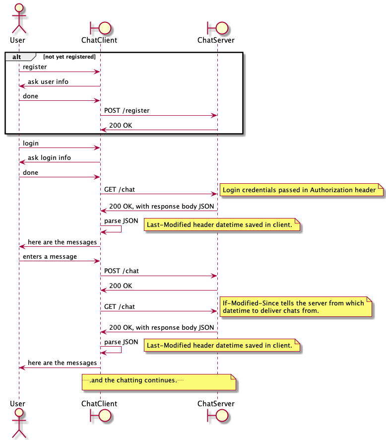

# O3 ChatClient

This project is a chat client app for Ohjelmointi 3 (Programming 3) course.

The client acts as a test client for the server students are developing at the course.

The client works with a server that has the following things implemented:

* HTTPS support with self-signed certificate.
* Basic HTTP Authentication support.
* `/registration` and `/chat` paths implemented.
* HTTP request and responses are in JSON.

That is, after *Exercise 3* has been finished successfully. You may test your
Exercise 3 implementation with the client as you work through the Exercise 3.
Before Exercise 3, use curl as the test client.

## Background

The protocol to use the server is outlined in the interaction diagram below. For details,
see the server API document at the course Moodle workspace.

The content of the HTTPS requests and responses are JSON. The JSON library to use is
included in the Maven `pom.xml` file included in the project.

The client assumes the server has a self-signed certificate created using the name "localhost".
For details, see the course Exercise 3 instructions for the phase where HTTPS support is added
to the server.

You must install the certificate to the directory where you run the client, as `localhost.cer` file.
That client certificate is then loaded in memory in `ChatHttpClient.createTrustingConnectionDebug`.

**Note** that you *should not* run real servers with self-signed certificates publicly, this is just for development
and learning purposes. Get a real certificate when deploying servers in the open and for real.

## Dependencies

You need the following to build and run the client:

* JDK 15
* Maven
* JSON library (see details from `pom.xml`)
* An IDE if you wish to view and/or edit the code.

The client app is structured as described in this high level UML class diagram:

Note that not all details are visible in this diagram.

## Building the client

Build the client from command line:

`mvn package`

You should then have a subdirectory `target` including .jar files for running the client.

If there are errors, check out the error output and sort out the issues.

You can also build and run the client from an IDE, e.g. Visual Studio Code or Eclipse.

The console UI in Eclipse may not work if debugging within Eclipse. In that case run the client
from the command line.

## Preparing the client

Since we are using a self signed certificate, you need to get the server's certificate to the client
to allow it to use non secure certificates. Make sure the server has already been configured to
use a self signed certificate you created, following the Exercise 3 instructions. Then:

1. Run the server
1. Using your web browser, access the server at `https://localhost:8001/chat`, assuming the defaults were used.
1. You will get a warning about non secure certificate.
1. View the certificate, either from the warning or by clicking the browser's lock symbol to view the site certificate.
1. When viewing the certificate, you can save it to the local computer. How this happens depends on the browser, so google that.
1. Save the certificate as `locahost.cer` to the *client* app `target` directory.

## Running the client

After you have build and prepared the client, you can run it.

Run the server first (on the same machine!), then launch the client. The client does run without 
the server, obviously, but registering, logging in, getting and posting messages will fail with an
error message.

The default server address is `https://localhost:8001/`. You can change it from the code, or from the
app when it is running using the command `/server`.

1. `cd target`
1. `java -jar <the-jar-file-with-dependencies-here.jar>`

If the launch fails due not having the main class of the project in classpath, try out:

`java -cp <the-jar-file> oy.tol.chatclient.ChatClient`

Note that the client fails to send and receive data if the server certificate has not
been saved to the target directory as `localhost.cer`, following the course instructions in Excercise 3.

For commands available in the client, enter `/help` in the client.

Test your server functionality with the client. In case you doubt the results, you can also use curl for
testing, following the course instructions.

## Information

(c) Antti Juustila 2020-2021, All rights reserved.

INTERACT Research Unit, University of Oulu, Finland