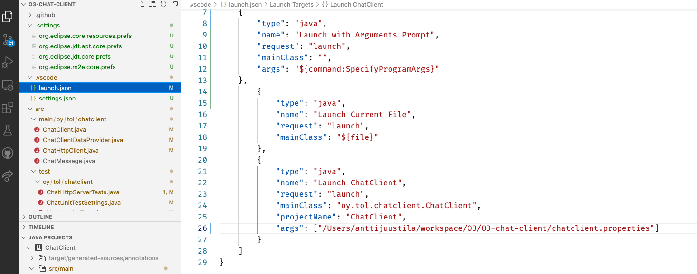

# O3 ChatClient

This project is a chat client app for Ohjelmointi 3 (Programming 3) course. The client acts
as a test client for the server students are developing at the course.

The client works with a server that has the following things implemented:

* HTTPS support with self-signed certificate.
* Basic HTTP Authentication support.
* `/registration` and `/chat` paths implemented.

That is, after *Exercise 2* has been finished successfully. You may test your
Exercise 2 implementation with the client as you work through the exercise.
In Exercise 1, use curl as the test client.

Note that you need to launch the client with two startup arguments. See instructions on
those below.

## Background

The protocol to use the server is outlined in the interaction diagram below. For details,
see the server API document at the course Moodle workspace.

The content of the HTTPS requests and responses are JSON. The JSON library to use is
included in the Maven `pom.xml` file included in the project.

For details, see the course Exercise 2 instructions for the phase where HTTPS support is added
to the server with a self signed certificate.

You must install the certificate to the directory where you run the client, as `localhost.cer` file.
That client certificate is then loaded in memory in `ChatHttpClient.createTrustingConnectionDebug`.
How to do this is explained below in *Preparing the client* section.

**Note** that you *should not* run real servers with self-signed certificates publicly, this is just for development
and learning purposes. Get a real certificate when deploying servers in the open and for real.

## Dependencies

The following are needed to build and run the client:

* JDK 15
* Maven
* JSON library (see details from `pom.xml`)
* An IDE if you wish to view and/or edit the code.

The client app is structured as described in this high level UML class diagram:

* `ChatClient` is the command line UI for the app, running the show.
* `ChatHttpClient` is used by the `ChatClient` to do the actual requests to the remote ChatServer.
* `ChatMessage`s are sent to and received from the server.
* `ChatHttpClient` does not "know" ChatClient, but accesses it using the interface class `ChatClientDataProvider`. When the http client wants the user settings (username, password, etc.), it asks these from the client using this interface the `ChatClient` implements.

Note that not all details of the implementation are visible in this diagram.

## Building the client

Build the client from command line:

`mvn package`

You should then have a subdirectory `target` including .jar files for running the client.

If there are errors, check out the error output and sort out the issues.

You can also build and run the client from an IDE, e.g. Visual Studio Code or Eclipse.

The console UI in Eclipse may not work if debugging within Eclipse. In that case run the client
from the command line.

Windows Command prompt does not by default support UTF-8, so any special chars may end up not transferring
properly. Prefer using VS Code terminal which does support UTF-8, or even better, use a proper terminal
app such as Terminus (Win/Linux/macOS) or iTerm (macOS).

## Preparing the client

Since we are using a self signed certificate in communicating with the server, you need to get the 
server's certificate to the client to allow it to use non secure certificates. Make sure the
server has already been configured to use a self signed certificate you created, following
the Exercise 3 instructions. Then:

1. Run the server
1. Using your web browser, access the server at `https://localhost:8001/chat`, assuming the defaults were used in implementation.
1. You will likely get a warning about non secure certificate.
1. View the certificate (see link below for browser specific info), either from the warning or by clicking the browser's lock symbol to view the site certificate.
1. When viewing the certificate, you then save it to the local computer. How this happens depends on the browser, so see the link below.
1. Save the certificate as `locahost.cer` to the client app source directory, for example.

For browser specific instructions on how to do this, check out [this link](https://www.shellhacks.com/get-ssl-certificate-from-server-site-url-export-download/).

Below you can read how to run the client either form terminal or from within VS Code.

## Running the client from terminal

After you have build and prepared the client, you can run it.

Run the server first (on the same machine!), then launch the client. The client does run without 
the server, obviously, but registering, logging in, getting and posting messages will fail with an
error message.

The default server address is `https://localhost:8001/`. You can change it from the code, or from the
app when it is running using the command `/server`.

You *have* to give the two parameters to the client as described below.

You can launch the client either from from the terminal (parameters are explained below):

1. `cd target`
1. `java -jar <the-jar-file-with-dependencies-here.jar> 2 C:\path\to\localhost.cer`

or in *nix machines:

1. `cd target`
1. `java -jar ChatClient-0.0.1-SNAPSHOT-jar-with-dependencies.jar 2 /path/to/localhost.cer`

* First parameter indicates which exercise version of the server are you testing. If you are testing
the exercise 2 implementation, give number two (2) as the first parameter. Give 5 as the fifth
exercise version, etc.
* The second parameter must the the path and filename of the server's client side certificate you 
prepared in the chapter Prepare the client above.

If you look at the client code, it uses (or does not use) certain features from the Server API, 
depending on the version number. For example, 

* if version is 2, then chat messages and registration info are sent and expected to be from server text strings, and
* if version info is 3, then client sends messages and registration info as JSON, and
expects the server to reply using JSON too.

Also, server expects to receive text strings (not JSON) in error situations (code is something else than 2xx) 
and tries to display those to the user. If your server does not do this, an exception happens but client
should not crash.

Exercise 4 only implements server internal database, so that has no effect on client/server comms. 
Exercise 5 (latter part) implements HTTP headers, which client also uses if the first startup parameter is 5. Take these 
into use in client by providing 5 as the first startup parameter.

## Running the client from VS Code

If debugging from VS Code, you still need to give the parameteres to the client. How to do that in
VS Code? If you don't have this already, add a launch configuration to the project. If you haven't
done that before, [take a look at this manual](https://code.visualstudio.com/docs/editor/debugging#_launch-configurations).  

Make sure you edit the red underlined ´args´ configuration in the `launch.json`, seen in the image below, so that:

* the first argument is the exercise number you are testing, and
* the second argument is a full path to the server's client certificate, saved as instructed 
in the Preparing the client section above. Do *not* use the server certificate you created with `keytool`
but the one you got using the browser and saved to a file.

Then when you launch the client, do use the Launch ChatClient launch configuration as you can see selected in the
upper left corner of the image above (red underlining).

## General usage of the client

Note that the client fails to send and receive data if the server certificate file is not
in the directory mentioned in the VS Code launch configuration or in the second command line parameter.

Run the client with the parameters, and you should then see the menu the client prints out. For commands 
available in the client, enter `/help` in the client. The usual process is:

1. First, `/register` the user with the server if not already registered. Unregistered users cannot send or get chats.
1. If user is already registered, `/login` with the registered user credentials.
1. Post new chat messages by writing the message to the console and pressing enter.
1. Get the latest messages from the server with command `/get`.
1. If the server seems to be working OK, enable automatically fetching new messages, once every second, using command `/auto`.
1. Open additional terminals and run the client there, login with different user account and chat with "the other person".
1. Exit the client app using the command `/exit`.

Test your server functionality with the client. In case you doubt the results, you can also use curl for
testing, following the course instructions.

If the server works with the client, your server should fulfill the requirements of the course.

Note that the current version does not yet implement the `/test` command. That feature is still
under construction. When it is implemented, you can use that to test the server with valid/invalid 
requests to see if your server is robust enough.

## Information

(c) Antti Juustila 2020-2021, All rights reserved.

INTERACT Research Unit, University of Oulu, Finland